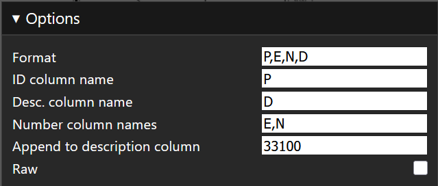

# coord-ocr

Coord OCR is a tool that allows one to drag and drop a PDF or image, draw a box around a table, and get a csv of the table contents.

Originally developed for DMSE for quickly gettting CSV data from coordinate tables on scanned property plans.

## Configuring Options



- Format: (Default "P,E,N,D" *for point, easting, northing, description*) Comma seperated list of column names. Used to determine the expected column count and where to split rows for columns, and for determining the index of special columns.
- ID column name: (Default "P" *for point*) Name of column (in format parameter) for the 'id' column. On a coordinate table, this would be the point column, for point name. 
- Desc. column name: (Default "D" *for description*) Name of description column.
- Number column names: (Default "E,N" *for easting, northing*) Name of columns that should be treated as numbers. Such columns have corrections applied for errors that I have found common for numbers in scanned plans.
- Append description to column: (Defaults to the current file name) Text that should be appended to the end of the description column. This is helpful because you can copy the the output to a running clipboard, described below, from multiple files.
- Raw: If true, don't process the text at all.

## Clipboard

After reading some text, you can click copy. This copies the text onto your clipboard, but also it copies text over to a clipboard box. Then, you can drop another file in and keep adding to this list of "rows".

There's also a button which appends letters in order to make duplicate ids unique. So if you have two 'points' named '22', one will be '22', the other will be '22a'.

## Recommended IDE Setup

[VSCode](https://code.visualstudio.com/) + [Volar](https://marketplace.visualstudio.com/items?itemName=Vue.volar) (and disable Vetur).

## Type Support for `.vue` Imports in TS

TypeScript cannot handle type information for `.vue` imports by default, so we replace the `tsc` CLI with `vue-tsc` for type checking. In editors, we need [Volar](https://marketplace.visualstudio.com/items?itemName=Vue.volar) to make the TypeScript language service aware of `.vue` types.

## Customize configuration

See [Vite Configuration Reference](https://vite.dev/config/).

## Project Setup

```sh
npm install
```

### Compile and Hot-Reload for Development

```sh
npm run dev
```

### Type-Check, Compile and Minify for Production

```sh
npm run build
```
